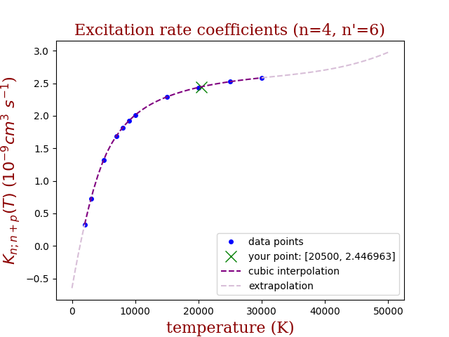

# HEXOCIN

## (H)ydrogen (EX)citation (CO)efficent (IN)terpolation
We give calculated excitation rate coefficients K n; n+p (T) for H*(n) + H(1s) collisions for principal
quantum number n between 4 and 20 (4 ≤ n ≤ 20) and 2 000 K ≤ T≤ 30 000 K where 1 ≤ p ≤ 5
(n’=n+p). The data for excitation coefficients were collected i.e. obtained by quantum
calculations [1] at conditions which satisfied resonant mechanism method [2].

## Data
The rate coefficient data were obtained computation using Fortran code on
computer cluster.

## Usage

The database is already generated with the parse_data.py script.

To run the main program:
```bash
python3 hexocin.py [-h] -n N -p P -t TEMP
```
where N is Principal quantum number, P is transition from n to n' and TEMP is temperature. Arguments should be integers with [4,20], [1,5] and [2000,30000] ranges respectively.

## Output

The output shows a plot with data points, parts of interpolated and extrapolated functions and calculated value for input arguments.




## Contact
Vladimir Sreckovic vlada(at)ipb.ac.rs

## Related research articles:
[1] Mihajlov, A. A., Ignjatovic, L. M., &amp; Dimitrijevic, M. S. 2005, Astron. Astrophys., 437, 1023

[2] Sreckovic, V. A., Mihajlov, A. A., Ignjatovic, L. M., &amp;Dimitrijevic, M. S. 2013, Astron.
Astrophys., 552, A3
